# AnimalMatch frontend

AnimalMatch is a web application designed to make wildlife individual identification faster and easier. It helps researchers and conservation teams annotate animals in videos, find matching individuals, and keep profiles and metadata organised in one place.

> [!NOTE]
> This codebase is still in active development. The database schema is subject to change and we may introduce breaking changes between updates.

## Features

**🗂️ Organise your data**
- 📁 Keep records organised in one place, with separate sections for videos, individuals, and image crops.
- 🔎 Find what you need quickly using search and grouping.
- 🖼️ Browse records in the way that best supports your workflow, including gallery/grid views, tables, and map views where available.

**✍️ Annotate individuals**
- ✂️ Extract image crops for each individual directly in the app using a built-in cropping tool.
- 🏷️ Tag each individual with useful characteristics (for example age, sex, and distinctive visual features).
- 📝 Open record detail views to review key information and update metadata as your annotations progress.

**🔍 Match and review**
- 🎯 Find potential matches of the same individual across different videos, and narrow results using tags/metadata.
- ↔️ Compare possible matches side by side to help with identification and review.
- 🔗 Move easily between related records (for example, from a video to an individual seen in it).

**🤝 Collaborate**
- 👥 Collaborate in one shared workspace with multiple user accounts.
- 🔗 Share direct links to records with collaborators.
- ⚡ Stay up to date with real-time data updates across your team.

### Coming soon:
- Individual profile merging
- Advanced metadata filtering
- Support for source images (currently, only source videos are supported)

## User guide

1. Download the prebuilt frontend from the [Releases](https://github.com/horaceleedev/AnimalMatch/releases) page

TODO add instructions for installing and setting up backend, and serving frontend

## Frontend overview
This frontend web app is implemented with React and TypeScript + SASS + HTML. Here are some other key libraries used:
* UI component library: [Ant Design](https://ant.design/)
* Client-side routing: [React Router v6](https://reactrouter.com/6.30.2)
* Global state management: [Zustand](https://github.com/pmndrs/zustand)
* JS utility library: [es-toolkit](https://es-toolkit.dev) (similar to Lodash)

Note: the source code for the VideoAnnotator component is not included in this repo at the moment, but the component is included in the prebuilt frontend on the [Releases](https://github.com/horaceleedev/AnimalMatch/releases) page.

## Development setup
Follow the instructions below only if you plan to modify/customise the frontend.
If you are using AnimalMatch as-is, you can skip this section and go to the [User guide](#user-guide).

### Prerequisites
- Make sure you have [npm](https://docs.npmjs.com/about-npm) installed beforehand. If you do not have `npm` installed, we recommend installing [nvm (Node Version Manager)](https://github.com/nvm-sh/nvm#install--update-script) first and then running `nvm install node` to install `npm` and `node`.
- Clone this repo, `cd` into this directory and then run `npm install` to install the project dependencies

### Start development server
1. Make sure you have completed the prerequisite steps above, and `cd`'ed into this directory if you haven't already done so
2. Start the development server using `npm run dev`. Once the server is running, open `localhost:5173` in your browser to access the development version of the frontend

### Production build
1. Make sure you have completed the prerequisite steps above, and `cd`'ed into this directory if you haven't already done so
2. Run `npm run build` to create a production build in the `dist` folder.

## Testing

Testing uses `Vitest` for fast `jsdom` tests, `Vitest Browser Mode` for browser-backed component tests, and `Playwright` for E2E.
All tests live under `/tests`, including Playwright specs in `/tests/e2e`.

- `npm run test` for the vitest component and ts unit tests
- `npm run test:browser` for vitest browser-mode component tests
- `npm run test:e2e` for Playwright E2E tests

First time setup: run `npx playwright install chromium` once before either the browser-mode or pw tests.

## React Components

Here is a diagram showing the key React components in this codebase:

(The diagram might not be reflect some recent changes in the codebase / it is not fully up to date)

Note:
- An arrow from A->B indicates that component B is used in component A. "Through Outlet" means that one component is displayed within another component via a React Router `<Outlet>`.
- Rounded rectangles represent 'dumb' components (i.e. presentational components) that don't have direct access to the global state
- Some minor components were not included in the diagram:
  - QueryOperationsButtons
  - VideoLinkButton, IndividualLinkButton
  - BasicMapView
  - InnerModal
  - etc

## Contact

Please submit any bug reports and feature requests on the [Issues](https://github.com/horaceleedev/AnimalMatch/issues) page.

If you have any questions or feedback, feel free to contact [Horace Lee](mailto:horace.lee@eng.ox.ac.uk).

## Acknowledgements
Development and maintenance of AnimalMatch has been supported by the [Visual AI](https://www.robots.ox.ac.uk/~vgg/projects/visualai/) research grant (UKRI Grant EP/T028572/1) as well as Schmidt Sciences, LLC.